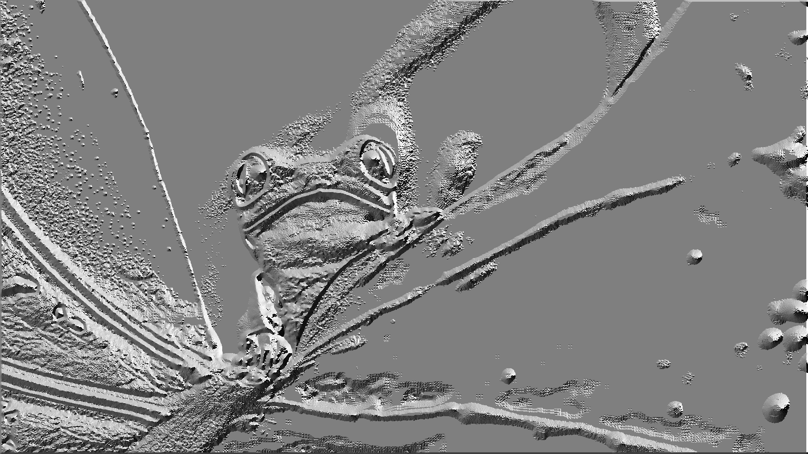

# Canny edge detection
Canny edge detectiom is popular edge detection algorithm. This project is implementation that algorithm in 3 ways to compare the performance of each implementation. The 3 ways are:
* Sequential
* Parallel using OpenMP
* Parallel using OpenCL
## Algorithm steps
0. Orginal image

1. Convert the image to grayscale

2. Apply Gaussian filter to smooth the image in order to remove the noise

3. Sobel filter
Sobel x

Sobel y

Sobel intensity

Sobel direction

4. Non-maximum suppression

5. Hysteresis thresholding

