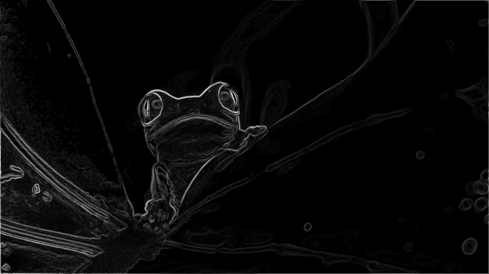
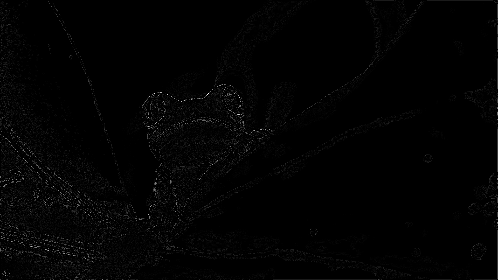

# Canny edge detection
Canny edge detectiom is popular edge detection algorithm. This project is implementation that algorithm in 3 ways to compare the performance of each implementation. The 3 ways are:
* Sequential
* Parallel using OpenMP
* Parallel using OpenCL
## Algorithm steps
0. Orginal image

1. Convert the image to grayscale

2. Apply Gaussian filter to smooth the image in order to remove the noise

3. Sobel filter
Sobel x

Sobel y

Sobel intensity

Sobel direction

4. Non-maximum suppression

5. Hysteresis thresholding

## Algorithm comprarison
### Tested device
* CPU: AMD Ryzen 5 2500U
* GPU: Radeon Vega 8 Gfx
## Performance comparison
Images used for creating algorithm (from images folder):
| Image Size | Sequential | OpenMP | OpenCL |
|------------|------------|--------|--------|
| 512x512    | 0.14s      | 0.07s  | 0.05s  |
| 512x512    | 0.13s      | 0.06s  | 0.04s  |
| 800x600    | 0.19s      | 0.11s  | 0.06s  |
| 1920x1080  | 0.90s      | 0.46s  | 0.29s  |
| 4032x2264  | 4.18s      | 1.99s  | 1.40s  |

Performence testing on diffrent size the same [image](https://www.flickr.com/photos/gsfc/6760135001/sizes/s/in/photostream/):
| Image Size | Sequential | OpenMP | OpenCL |
|------------|------------|--------|--------|
| 240x240    | 0.03s      | 0.01s  | 0.00s  |
| 320x320    | 0.05s      | 0.02s  | 0.01s  |
| 400x400    | 0.08s      | 0.03s  | 0.02s  |
| 640x640    | 0.18s      | 0.08s  | 0.06s  |
| 800x800    | 0.28s      | 0.13s  | 0.08s  |
| 1024x1024  | 0.57s      | 0.21s  | 0.15s  |
| 1600x1600  | 1.06s      | 0.47s  | 0.29s  |
| 2048x2048  | 2.29s      | 0.93s  | 0.56s  |
| 3072x3072  | 7.32s      | 2.15s  | 1.34s  |
| 4096x4096  | 13.29s     | 4.45s  | 2.35s  |
| 5120x5120  | 27.34s     | 8.34s  | 3.71s  |
| 6144x6144  | 39.24s     | 15.34s | 5.32s  |
